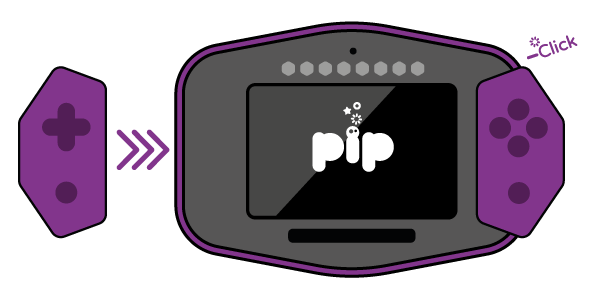
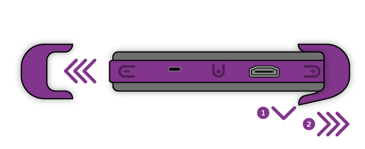
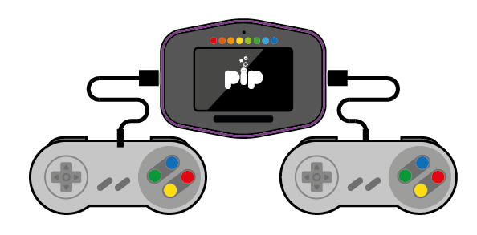

# Getting Started

---

## Pip overview:



---

## MicroSD Card

Pip ships with a MicroSD card already inserted, which boots into our custom software. You can run RetroPie or Raspbian on Pip (some tweaks may be required and there are links to these files in the downloads section).




The MicroSD card slot is spring loaded. Do not pull the card out without ejecting it first.


You must NEVER eject the MicroSD card whilst Pip is running. Doing so may corrupt the data on your card, rendering it unusable.


---

## Controllers

Pip's USB controllers are easy to attach and connect to Pip through the USB connectors on either side. 



<--->
### Connecting Controllers
Simply guide in from the side to connect to the USB ports until you feel the controllers lock in place. There are grooves on the back of Pip that help guide in the controllers.



This may sound a bit silly, but it is possible to insert them into the wrong side, so make sure the directional controller is inserted to the left of the touchscreen and buttons to the right.


---



<--->
### Removing Controllers
Before sliding each controller from the base unit, gently lift the rear edge of the controller to release the unit. You are best doing this one controller at a time, unless you have a third hand to catch Pip, which you probably don’t.



---



<--->
### Third Party Controllers
Any USB controller can be used with Pip. Controllers can be attached to the USB connectors on either side and if more than 2 controllers are required, you can attach a USB hub to Pip to play multi-player games.



---

## Buttons

Pip's controller buttons are similar to those normally found on other games controllers. When coding your own apps or games, these buttons can be programmed to do whatever you choose.




When both controllers are attached to Pip, they are merged together and seen by Pip as a single controller. 


There are 3 buttons on Pip itself that are used for a variety of functions:


The **MIDDLE** button is used for booting up, battery indication, selecting volume and brightness settings, quitting apps and for shutting down. Further details on these functions are given further down this page.

The **UP** and **DOWN** shoulder buttons are used to adjust screen brightness and volume, however can be used in your own apps or games to provide other functions. When Pip's game controllers are connected, these buttons become part of the gamepad.

---

## Battery check and charging

Pip's built-in LEDs are used to indicate how much battery charge is remaining. A **QUICK TAP** of the middle button will show you the charge level of the battery. When the MicroUSB cable is plugged in and Pip is charging, a tap of the middle button shows an animated sequence to confirm that the battery is charging and the charge level it has reached.



Pip is charged using the supplied MicroUSB cable, or indeed any good quality MicroUSB cable. The fastest way to charge Pip is by plugging it into a dedicated mains USB charger. You can charge Pip using a computer USB port, however Pip will only be able to charge at half the normal rate using this method (limited to 500mA).


Pip needs a **MINIMUM** of 2 bars to boot up. If your charge is less than this, a warning sequence will be flashed using the built-in LEDs. Once the minimum charge is reached, you can use Pip whilst it is charging.


---

## Booting up

To boot Pip, press and the **MIDDLE** button for at least 3 seconds until the lights display the boot sequence. After a few seconds, the splash screen will be displayed and Pip will then boot into PipOS. 




Once booted, you navigate the apps using the touchscreen. If you have more than 8 apps installed, you can navigate between the screens by swiping left or right on the touchscreen. At this stage, you cannot use the controllers to select and load apps.


---

## Kickstand

To use the kickstand, put the tip of your finger into the hexagonal recess in the rear casing of Pip and pull out the kickstand. The kickstand should lock into position.



To close the kickstand, hold the bottom of the kickstand and push it back into the case until it locks into place.